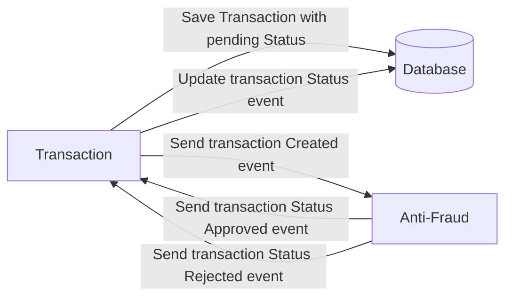

 

  

## Yape problem solved:

Every time a financial transaction is created it must be validated by our anti-fraud microservice and then the same service sends a message back to update the transaction status.
For now, we have only three transaction statuses:

<ol>
  <li>pending</li>
  <li>approved</li>
  <li>rejected</li>  
</ol>

Every transaction with a value greater than 1000 should be rejected.

## Backend stack
- Typescript
- Express
- kafka
- Postgress
- TypeOrm
- Jest

## Architectures
- Microservicios
- transactions-service: Clean Architecture
- antifraud-service: Event-Driven Architecture (EDA)

### API Usage

1. Run ``docker-compose up --build -d`` to start the Docker containers in detached mode.
2. Ensure that both services are successfully launched and operational.

### Run the tests

#### Note
1. To access the services
- Access the backend transactions service at [http://localhost:8070](http://localhost:8070).
- Access the backend anti-fraud service at [http://localhost:8071](http://localhost:8071).

2. To run the tests
- Transactions: `cd transactions-service` `npm test`
- Antifraud: `cd anti-fraud-service` `npm test`

